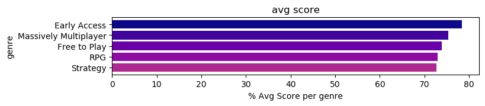
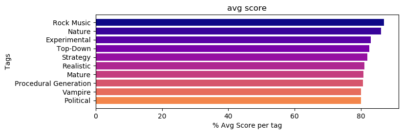
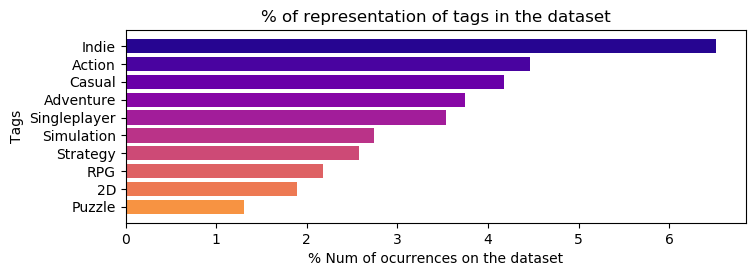
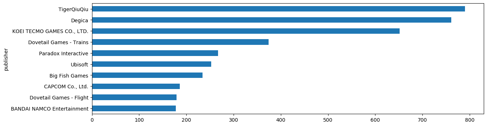
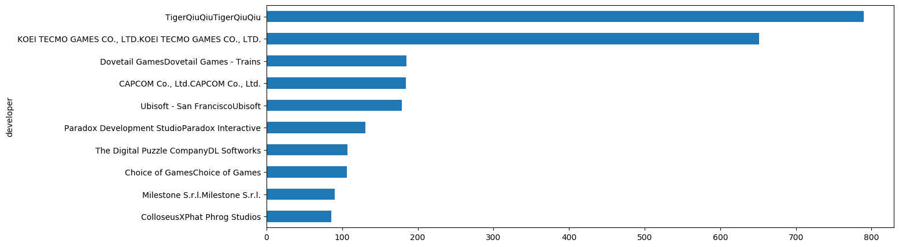
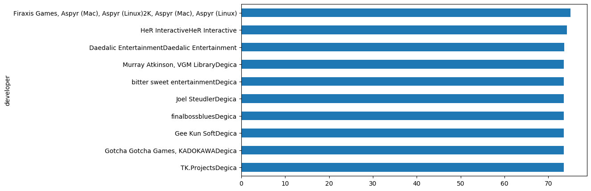
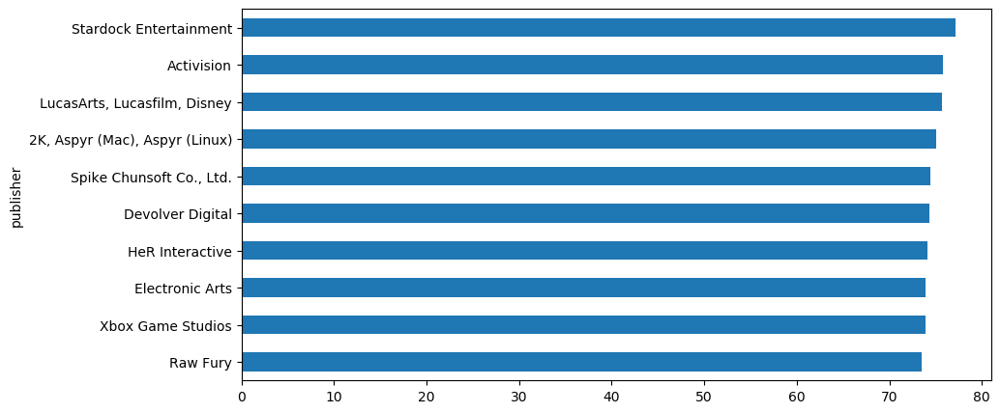
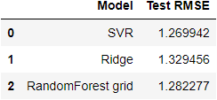
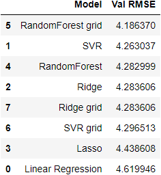

# Proyect Summary

In this proyect I do a exploratory data analysis of a dataset that contains scrapped data of the games from the steam store, with the porpuse of gathering insights of which type of games where the best recived by the players as well as which publishers and developers where the best scored on average and how all of the mentioned relate with the metascore.

After the EDA I've wanted to make a model that could predict the score that a game will have over time, this could be usefull for users at the time of buying a new game helping them by informing them with an expected result to make the right choise of buying it and prevent issues like mass refounds due to scams or bad games.Recent examples of this could be No man sky on release or battlefield 2042 where at realease they deliver less than the advertised to the point where the game wasn't liked by the playerbase and caused steam to deliver mass refounds out of the conventional refound policies.

## Things to take in mind of the dataset and model

I've used a modified version of this scrapper [https://github.com/prncc/steam-scraper]() which worked fine but got some issues with the scrapped data that I didn't see while it was scrapping and I've only got ~5% of the metascores as well as some other issues that are seen during the EDA that could impact the results of the EDA and the model accuracy. I didn't restart the scraping process because of two things: 
1) I wanted to chalenge my self with awful looking data and see if I could manage to salvage it. 

2) I took around 12 hours to gather the data and I didn't feel to do it again for this proyect.

The model needs of the avg genre/tag scores csv files in order to do the predictions since it pre calculates the average of all the tags/genres it has before doing the prediction.

## EDA Summary

### Genres and tags

* Most liked genres are Early Access, MMO, Free To play and RPG.

* Most liked tags are Rock Music, Nature, Experimental, Top-down and strategy.

* 68% of the games are from Indie, Action, Casual, Simulation and Adventure genres and as tags they can be found in 22% of the games.
* Most common tag is Indie with 6.5% representation.

### Publishers and Developers

* Most of the best-most known publishers and developers metascores came from games between 2012-2016 and releases after that period start falling to an avg value of ~75%
* The publisher & developer with the most game relased is TigerQiuQiu but dispite this, their games got very few reviews for steam to set them a score, so they got caught by the metascore cleaning process and got set to an avg based on their tags and genres.

* The developer avg score is 72.56% and the publishers avg score is 72.61
* The lowest publishers and developers with 20 or more releases got an avg metascore a bit under the overall avg of their respective groups.
* 2K Aspyr has the highest metascore avg for developers by being ~3% above the avg.

* Stardock entretainment has the highest metascore avg for publishers by being ~5% above the avg.

## Model Summary

I used RMSE to mesure model performance.

* The best Model is a SVR with 1.269942 RMSE on the test data.

### Test Data results

### Val Data results

## Things to Imporve

* I'm pretty sure that if I scraped the data more efficiently by doing a small test of 1-2mins instead of just testing it on a very small sample of 50-100 games I would have seen the problem with the metascores and had way better data to work with.
* I should try to make the model not depend on the avg scores dataframe.
* I had to one hot enconde the 2d columns (tags and genre) manually and they are outside of the pipeline.
